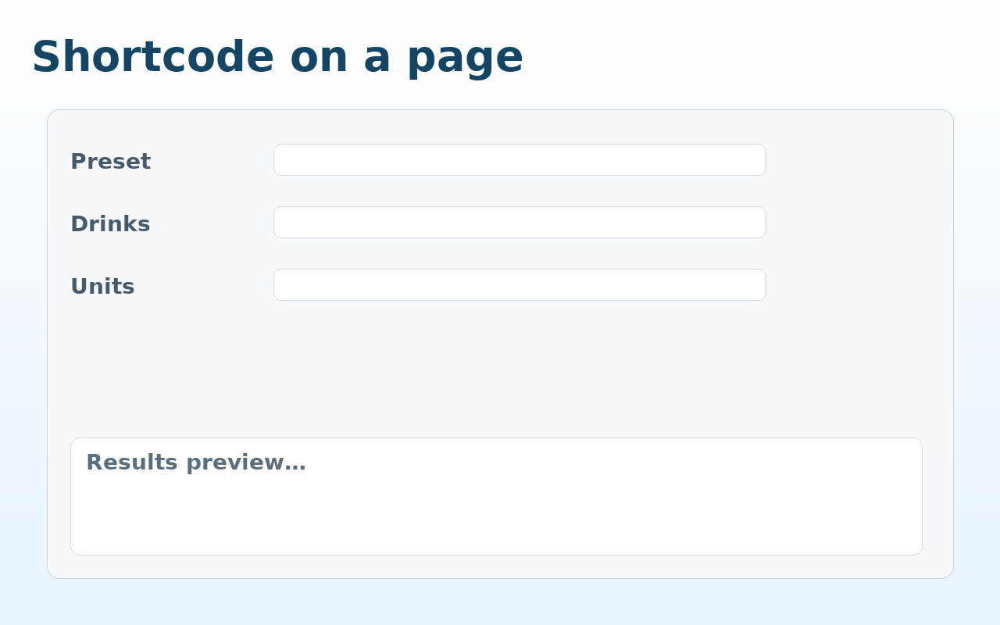
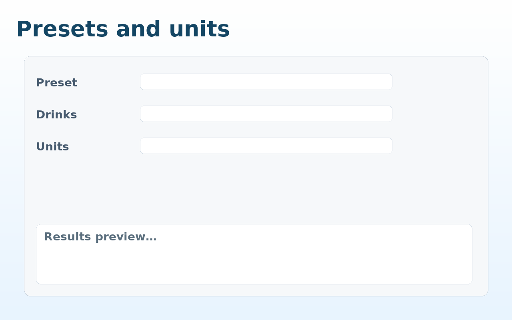
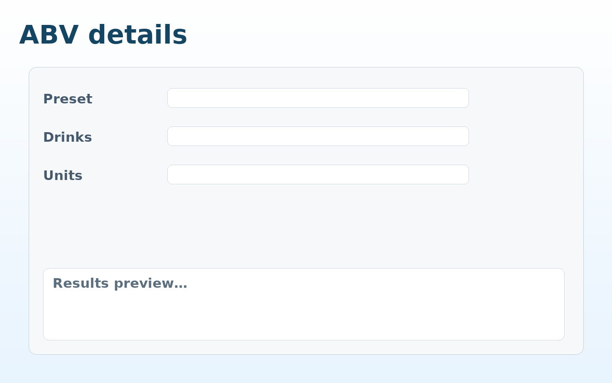

# 🍸 Margarita Measurements

Interactive WordPress plugin to calculate the perfect Margarita cocktail ratios — with presets, unit switching, and ABV estimates. Works as a **shortcode** or **Gutenberg block**.


## ✨ Features
- Presets: **Classic**, **Tommy’s**, **Frozen**, **Skinny**
- Units: **ml**, **oz**, **shot**, **nip**
- ABV estimate (toggle in settings)
- AJAX form (no page reload), accessible, responsive
- Shortcode: `[margarita_measurements]`
- Gutenberg block: **Margarita Measurements**
- REST endpoint:
  ```
  /wp-json/margarita/v1/calculate?preset=classic&drinks=4&unit=ml
  ```
- Uninstall cleanup, i18n-ready

## 🚀 Installation
1. Download or clone this repository.
2. Upload to `wp-content/plugins`.
3. Activate via **Plugins → Installed Plugins**.
4. Insert shortcode or use the block.

## ⚙️ Settings
- Default unit
- Default preset
- Max drinks per calculation
- Toggle ABV display

## 📸 Screenshots
1. Shortcode on a page  
   
2. Presets and units  
   
3. ABV details  
   

## 🧑‍💻 Development
- PHP 7.4+, WP 5.8+
- PHPUnit (optional)
- PHPCS (WordPress standards)

### Commands
```bash
vendor/bin/phpunit
phpcs --standard=WordPress .
```

## 🤝 Contributing
See [CONTRIBUTING.md](CONTRIBUTING.md). PRs welcome.

## 📜 License
GPL v2 or later. See [LICENSE](LICENSE).
